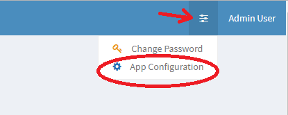

## Example Page


With a codebox
```
 place your code:
    here
    and here
```

And you can have <code>inline code here</code>

**bold**
 - list
 - list


Using inline HTML:


<p style="font-size: 20pt;">Like this</p>

Example link [to myself](example.html)

Example image include:


